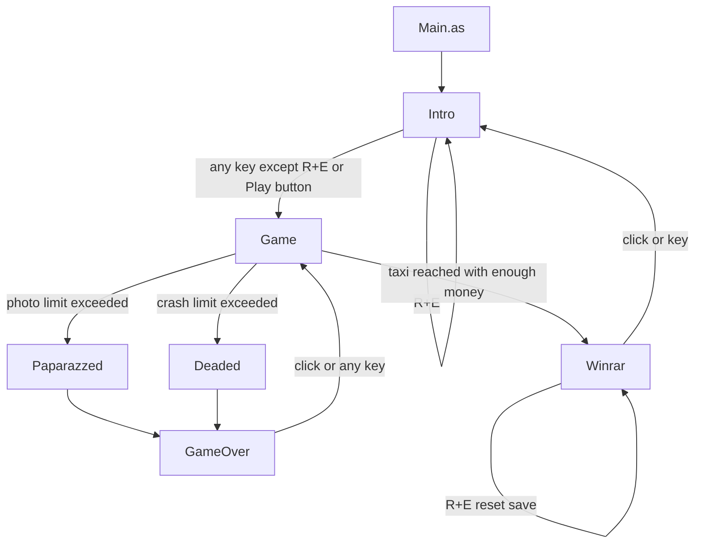

# Escaparazzi Porting Implementation Guide

## Goal

The current codebase ships the whole game as a Flash/Flixel application, but the actual gameplay rules are small enough to extract into a framework-agnostic core. This document separates:

- portable game logic we should keep
- Flixel/Flash runtime concerns we should replace
- mixed code that must be split before a clean port

The objective is not to port `org/flixel/**`. The objective is to preserve Escaparazzi's rules and feel while making the runtime replaceable.

## Repository Anatomy

| Path | Role today | Porting note |
| --- | --- | --- |
| `src/Main.as` | Boots Flixel at 320x240 with 2x scale and starts `Intro` | App/bootstrap only |
| `src/Preloader.as` | Flash preloader wrapper | App/bootstrap only |
| `src/scenes/Game.as` | Main play state, simulation, input, collisions, score, FX, audio, scene changes | Main file to split |
| `src/scenes/Intro.as` | Title screen and Flash-native buttons | UI only |
| `src/scenes/GameOver.as` | Restart screen | UI only |
| `src/scenes/Paparazzed.as` | Camera-loss transition scene | Presentation only |
| `src/scenes/Deaded.as` | Crash-loss transition scene | Presentation only |
| `src/scenes/Winrar.as` | Win screen and save trigger | Presentation plus persistence trigger |
| `src/util/Data.as` | Global score/high score save data via `SharedObject` | Replace with save/session layer |
| `src/registry/AssetsRegistry.as` | Embedded art/audio/font/shader manifest | Replace with renderer-specific asset map |
| `src/util/Gamejolt.as` | Legacy GameJolt API wrapper | Currently unused; do not port initially |
| `src/org/flixel/**` | Vendored engine source | Treat as external dependency, not game code |

## Current Runtime Flow



Relevant source anchors:

- `src/Main.as:14-22`
- `src/scenes/Intro.as:35-115`
- `src/scenes/Game.as:232-338`
- `src/scenes/Paparazzed.as:35-84`
- `src/scenes/Deaded.as:37-91`
- `src/scenes/GameOver.as:30-55`
- `src/scenes/Winrar.as:35-74`

## What Is Actually Portable Game Logic

### Core gameplay rules

These are the parts we should preserve across frameworks:

- World size is `320x240`, with player movement in `16x16` steps (`src/Main.as:21`, `src/scenes/Game.as:179-182`, `src/scenes/Game.as:574-610`).
- The player wraps around screen edges instead of colliding with walls (`src/scenes/Game.as:576-607`).
- The player cannot reverse direction immediately; input only changes facing if it is not the opposite direction (`src/scenes/Game.as:852-859`).
- The player is chased by a follower chain. The chain includes two invisible spacer nodes plus visible paparazzi followers (`src/scenes/Game.as:145-157`, `src/scenes/Game.as:614-623`).
- Followers can be killed by traffic, which awards score and may drop a money pickup (`src/scenes/Game.as:391-456`).
- Cars move in opposite directions across the screen with small vertical jitter and wrap when leaving the playfield (`src/scenes/Game.as:497-559`).
- A taxi begins spawning once money is high enough, and taking the taxi with enough money triggers the win sequence (`src/scenes/Game.as:499-502`, `src/scenes/Game.as:727-778`).
- Damage is the sum of paparazzi photos plus car crashes. The game loses when the combined total exceeds 8, which means the 9th hit is fatal (`src/scenes/Game.as:377-379`, `src/scenes/Game.as:473-475`, `src/scenes/Game.as:878-887`).
- Score changes are deterministic:
  - player hit by car: `+100` (`src/scenes/Game.as:357-389`)
  - follower hit by car: `+250` (`src/scenes/Game.as:391-456`)
  - collect money pickup: `+500` (`src/scenes/Game.as:831-846`)
  - cash out remaining followers during taxi win: `+1000` per follower, excluding player and the 2 spacer nodes (`src/scenes/Game.as:745-776`)
- High score is only updated and saved on a successful win, not on failed runs (`src/scenes/Game.as:748-755`, `src/scenes/Winrar.as:49-52`).

### Non-portable engine/runtime concerns

These should move behind adapters:

- `FlxState` lifecycle: `create`, `update`, `preProcess`, `postProcess`
- `FlxSprite`, `FlxGroup`, `FlxText`, `FlxSound`
- `FlxU.overlap` collision queries
- `FlxG.keys`, `FlxG.mouse`, `FlxKeyboard.any`
- `FlxG.play`, `FlxG.playMusic`, `FlxG.quake`
- shader/filter application to the render buffer
- embedded asset classes in `AssetsRegistry`
- `SharedObject` persistence
- Flash `Sprite` buttons and `navigateToURL` in the intro scene

### Mixed code that currently needs splitting

`src/scenes/Game.as` is the big mixed layer. The same functions mutate game state and also trigger view/audio side effects:

- `crash()` changes score and damage, removes cars, spawns new cars, plays sound, starts shake, and spawns explosion FX
- `deadPaparazzo()` and `deadOpositePaparazzo()` change score, remove entities, drop money, play sound, and spawn explosions
- `deadpopStar()` advances camera-damage logic and triggers camera-flash FX
- `collectMoney()` changes score and inventory, plays sound, and removes a sprite
- `takeCab()` and `winComplicated()` combine win-rule transitions with score text, money FX sprites, and sound
- `update()` mixes timers, HUD updates, movement ticks, overlap resolution, effect cleanup, and scene transitions

Those functions should become pure rule systems plus a stream of effect commands for the adapter.

## Current Gameplay Model

### 1. World and timing

- The game is mostly a discrete step game, not a continuous physics game.
- The player, followers, cars, and taxi all move in coarse update ticks controlled by `nextMove` and `popStarSpeed` using `getTimer()` (`src/scenes/Game.as:133`, `src/scenes/Game.as:304-310`).
- Frame time is still used for cooldown timers like photo cooldown, money pickup delay, win drain, overlays, and transient animations (`src/scenes/Game.as:237-276`, `src/scenes/Game.as:329`, `src/scenes/Game.as:809-817`).
- The player starts auto-moving immediately because `popStar.facing` is initialized to `UP`, but movement halts if no directional input has been held recently enough and `inputTimer <= 0.1` (`src/scenes/Game.as:80`, `src/scenes/Game.as:182`, `src/scenes/Game.as:578-607`, `src/scenes/Game.as:848-866`).
- Important consequence for the port: movement/collision should preserve the current tick cadence, even if the target framework prefers continuous physics.

### 2. Initial state and tuning values

At game start (`src/scenes/Game.as:127-230`):

- score = `0`
- money = `0`
- photos = `0`
- crashes = `0`
- `popStarSpeed = 150`
- `nextMove = now + 300ms`
- `timerPaparazzi = 4.0s`
- `moneyzTimer = 11.0s`
- `cashGrab = 9999`
- `winnarTimer = 0.2s`
- `explodeTimer = 0.1s`

Initial entities:

- `popStarMob` contains 6 members:
  - player at index `0`
  - spacer nodes at indices `1` and `2`
  - 3 real paparazzi followers at indices `3`, `4`, `5`
- `traffic` contains 1 invisible sentinel plus 1 real car
- `opositeTraffic` contains only its invisible sentinel
- `taxiLane` contains only its invisible sentinel
- there is no money pickup yet

These numbers should move into a config object in the extracted core so the port does not scatter balancing constants across renderer code.

### 3. Player and follower chain

- `popStarMob` is the chase chain.
- Member `0` becomes the player after loading the star graphic (`src/scenes/Game.as:153-182`).
- Members `1` and `2` are invisible spacer nodes (`src/scenes/Game.as:154-177`).
- Members `3+` are real paparazzi followers.
- When the player moves, each later chain element copies the previous element's old position with random jitter of `[-4, 4]` on both axes (`src/scenes/Game.as:614-623`).
- New followers spawn on a timer:
  - initial spawn timer starts at 4 seconds (`src/scenes/Game.as:105`, `src/scenes/Game.as:276-296`)
  - after that it repeats every 1 second
  - higher `moneyzAmount` increases both spawn intensity and player speed pressure

This follower-chain model is game logic and should not be represented as invisible framework sprites in the port. The spacer nodes should become explicit simulation data, for example:

- `spacerCount = 2`
- `followers: Follower[]`
- `trailHistory` or `segments[]`

### 4. Traffic and taxi

- `traffic` moves left-to-right by `+16` pixels each tick with random vertical wobble `[-8, 8]` (`src/scenes/Game.as:504-520`).
- `opositeTraffic` moves right-to-left by `-16` pixels each tick with the same wobble (`src/scenes/Game.as:543-559`).
- `taxiLane` also moves left-to-right by `+16` with milder wobble `[-4, 4]` (`src/scenes/Game.as:522-537`).
- Each lane keeps a sentinel element at index `0`, so most loops intentionally start at the end and stop at `> 0`.
- The port should remove this sentinel-sprite pattern and store normal entity lists instead.
- When cars from opposite flows overlap, `correrse()` pushes them apart by 6 pixels on both axes instead of destroying either car (`src/scenes/Game.as:339-355`).
- A taxi starts spawning once `moneyzAmount > 3` (`src/scenes/Game.as:499-502`).
- The player can only actually win when colliding with a taxi and `moneyzAmount > 4` (`src/scenes/Game.as:727-742`).

Important current quirk:

- `spawnMoreCars()` chooses `rand(-1, 1)` and only spawns normal traffic when the value is positive (`1`). That means opposite traffic is favored 2/3 of the time (`src/scenes/Game.as:479-495`).

### 5. Damage and failure

- `timerPhoto` is a shared cooldown for both photo damage and crash damage (`src/scenes/Game.as:104`, `src/scenes/Game.as:370-375`, `src/scenes/Game.as:462-470`).
- A paparazzi overlap increases `fotos` only when that cooldown has elapsed (`src/scenes/Game.as:460-477`).
- A car overlap increases `choques` only when the same cooldown has elapsed (`src/scenes/Game.as:370-375`).
- Because the cooldown is shared, rapid overlapping hits are intentionally rate-limited.
- Loss thresholds:
  - photo loss path: `Paparazzed` when `fotos + choques > 8` inside `deadpopStar()` (`src/scenes/Game.as:473-475`)
  - crash loss path: `Deaded` when `choques + fotos > 8` inside `crash()` (`src/scenes/Game.as:377-379`)

This is strong evidence that the portable core should model "damage" as one combined meter with separate counters for presentation and statistics.

### 6. Money and score loop

- Followers do not directly give money. They may drop a single money pickup when killed by traffic and only if no money pickup is already active (`src/scenes/Game.as:412-414`, `src/scenes/Game.as:449-451`).
- That means there is an important single-coin invariant in the current game.
- Money pickups expire on a timer and turn into a poof animation if ignored (`src/scenes/Game.as:236-251`, `src/scenes/Game.as:822-829`).
- Collecting a pickup does not immediately increment `moneyzAmount`.
- Instead it starts `cashGrab = 0.3`, and the actual money counter increments once that cooldown finishes (`src/scenes/Game.as:255-261`, `src/scenes/Game.as:844`).
- This delayed inventory update matters because taxi eligibility uses `moneyzAmount`, not pickup count.
- The HUD is a countdown-style meter from `NEED_05` to `NEED_00` based on `moneyzAmount` (`src/scenes/Game.as:868-876`).

### 7. Win flow

- Touching a taxi with enough money sets `winnar = true` (`src/scenes/Game.as:727-730`).
- If visible followers still exist, the game cashes them out one at a time over time using `winComplicated()` (`src/scenes/Game.as:732-776`).
- The win bonus is computed once as `(popStarMob.members.length - 3) * 1000`, which excludes the player and the two invisible spacer nodes (`src/scenes/Game.as:746-755`).
- Each follower then disappears with a money animation and sound (`src/scenes/Game.as:758-775`).
- Once only the player plus spacer nodes remain, the game enters `Winrar` (`src/scenes/Game.as:736-739`).

For the port, this should become a clean state machine:

- `Running`
- `WinningDrainFollowers`
- `Won`
- `LostByPhotos`
- `LostByCrashes`

### 8. Persistence

- `Data` is a global static singleton used by scenes (`src/util/Data.as:15-27`).
- It persists:
  - `highScore`
  - `achievements` array, though achievements are currently unused
- It does not persist the active run, and it does not save on a failed game.
- `currentScore` is session-only.
- `Data.reset()` clears high score and achievements (`src/util/Data.as:46-49`).

The save schema is simple and portable, but the global static access pattern should not be carried forward.

## Flixel/Flash Dependency Audit

| Concern | Current implementation | Keep in core? | Adapter target |
| --- | --- | --- | --- |
| Game state lifecycle | `FlxState` methods in scene files | No | Scene/screen controller |
| Input polling | `FlxG.keys`, `FlxKeyboard.any`, `FlxG.mouse` | No | Input adapter producing an `InputSnapshot` |
| Collision detection | `FlxU.overlap(...)` | No | Core collision system or target framework physics bridge |
| World entities | `FlxSprite` and `FlxGroup` | No | Plain data structs in core |
| Text and HUD sprites | `FlxText`, HUD `FlxSprite` assets | No | Renderer/view model |
| Sound/music | `FlxG.play`, `FlxG.playMusic`, `FlxSound` | No | Audio adapter |
| Camera shake and overlays | `FlxG.quake`, flash/red sprites, scanlines | No | Effect commands handled by renderer |
| Shader/filter | `preProcess()` buffer filter | No | Renderer post-process effect |
| Save data | `SharedObject` | No | Save repository |
| Charity button and external URL | Flash `Sprite` and `navigateToURL` | No | UI framework button/open-url service |
| Score, money, damage, timers, win/loss rules | mostly `Game.as` | Yes | Pure gameplay core |

## Recommended Target Architecture

### 1. Framework-agnostic core

Create a pure gameplay package with no Flixel imports:

```text
core/
  GameState
  GameConfig
  GamePhase
  Direction
  entities/
    Player
    Follower
    Vehicle
    Coin
    Taxi
  systems/
    InputSystem
    MovementSystem
    FollowerSystem
    SpawnSystem
    CollisionSystem
    ScoreSystem
    WinLossSystem
  events/
    GameEvent
    RenderEffect
    AudioCue
  persistence/
    SaveData
```

Suggested responsibilities:

- `GameState`: pure model for all simulation state
- `GameConfig`: dimensions, speeds, thresholds, timers, score values
- `tick(state, input, dt, rng, now) -> TickResult`: single pure entry point
- `TickResult`: next state plus emitted events/effects

### 2. Adapter layer per framework

Each framework should provide:

- input collection
- scene/screen transitions
- sprite creation and animation selection
- sound playback
- post-processing and screen shake
- save/load implementation
- menu and win/lose presentation

The adapter should consume core events instead of deciding rules.

Example event stream:

```text
PlaySound("crash")
SpawnFx("explosion", x, y)
ScreenFlash("white", 0.1)
ScreenFlash("red", 0.1)
CameraShake(0.01, 0.1)
ScorePopup(250, x, y)
TransitionTo("deaded")
```

That keeps the core deterministic while letting the new framework implement visuals however it likes.

### 3. Suggested core data model

One reasonable shape:

```text
GameState
  phase
  score
  highScore
  money
  damage:
    photos
    crashes
    cooldownMs
  player:
    x
    y
    facing
    idleTimeoutMs
  chain:
    spacerCount = 2
    followers[]
    leaderTrail[]
    pendingSpawn
  traffic:
    forwardCars[]
    reverseCars[]
    taxi: Taxi?
  pickups:
    activeCoin: Coin?
    pendingCashMs?
  timers:
    nextMoveAtMs
    paparazziSpawnMs
    winDrainMs
    explosionFxMs
  transient:
    scorePopups[]
```

Recommendation: use pixel coordinates in core, not tile coordinates, because the cars and taxi use non-grid vertical wobble and collision is rectangle based.

## How To Split The Current Code

| Current function/file | Problem | Destination after split |
| --- | --- | --- |
| `Game.create()` | Creates both simulation state and Flixel sprites | `GameCore.newGame()` plus adapter scene setup |
| `Game.update()` | Central mixed loop | `GameCore.tick()` plus adapter event handling |
| `handlePlayerInput()` | Reads Flixel keys directly | input adapter -> `InputSnapshot` |
| `moveMob()` | Moves player/followers and spawns followers | core movement/spawn systems |
| `moveTraffic()` / `moveOpositeTraffic()` | Vehicle simulation mixed with taxi spawn | core vehicle system |
| `crash()` | Collision rule mixed with sound/FX/UI | core collision resolver + emitted effects |
| `deadPaparazzo()` / `deadOpositePaparazzo()` | Same | core collision resolver + emitted effects |
| `deadpopStar()` | Same | core collision resolver + emitted effects |
| `collectMoney()` | Same | core pickup system + emitted effects |
| `takeCab()` / `winComplicated()` | Win-state logic mixed with presentation | core phase machine + adapter FX |
| `updateHUD()` | Loads graphics directly from state | renderer/view model |
| `coinSnd()` / `crashSnd()` / `cameraSnd()` | Random audio selection inside logic file | adapter audio policy driven by emitted cue |
| `Data` | Global mutable singleton | save repository + app session model |
| `Intro`, `GameOver`, `Paparazzed`, `Deaded`, `Winrar` | Mostly presentation and navigation | keep as UI/screens in target framework |

## Recommended Extraction Order

### Phase 1: Freeze behavior with tests and notes

Before porting, write characterization tests for:

- player wrap-around in all four directions
- no direct reverse turns
- follower chain delay with exactly 2 spacer nodes
- crash score `+100`
- follower kill score `+250`
- money pickup score `+500`
- win cash-out score `+1000` per visible follower
- fatal threshold at 9 total damage
- taxi spawns at money `4`, win allowed at money `5`
- only one active coin at a time
- high score only updates on successful win

These tests can be written against a new core without changing rendering first.

### Phase 2: Extract a pure `GameState`

Move the following out of `Game.as` first:

- numeric constants and thresholds
- score and money counters
- damage counters
- timers
- positions and facing
- follower, car, taxi, and coin lists

At this point, Flixel sprites should become views of core state rather than the state itself.

### Phase 3: Replace `FlxU.overlap` with explicit core collision logic

The current rules do not require engine physics. Axis-aligned rectangle overlap is enough:

- player vs paparazzi
- player vs forward cars
- player vs reverse cars
- cars vs followers
- player vs coin
- player vs taxi
- forward cars vs reverse cars

Once collision logic is pure, the rest of the port becomes much easier.

### Phase 4: Introduce event/effect output

Instead of calling Flixel directly, core systems should emit events:

- `CrashOccurred`
- `PhotoTaken`
- `FollowerKilled`
- `CoinSpawned`
- `CoinCollected`
- `TaxiReached`
- `LostByCrash`
- `LostByPhotos`
- `Won`

Presentation systems can translate those into:

- sounds
- screen flash
- camera shake
- HUD animation
- explosion animation
- scene transition

### Phase 5: Rebuild screens on top of the core

At that point, `Intro`, `GameOver`, `Paparazzed`, `Deaded`, and `Winrar` can be rebuilt in any framework because they are already mostly presentation.

## Preserve-vs-Modernize Decisions

These are current behaviors we should decide intentionally rather than accidentally changing during the port:

1. High score only saves on win. This is probably a legacy design choice, not a technical necessity.
2. The follower chain uses 2 invisible spacer nodes. We should preserve the spacing behavior, but not necessarily the implementation trick.
3. Taxi appears at 4 money but victory requires 5 money.
4. Damage is throttled by one shared cooldown for both photos and crashes.
5. `spawnMoreCars()` currently biases opposite-direction traffic.
6. `moneyzAmount` can theoretically exceed the HUD's defined range of `0..5`.
7. Follower spawn intensity is only explicitly handled up to case `6` in `moveMob()`.
8. `GameOver` restarts directly into gameplay, while `Winrar` returns to the intro screen.

If we want exact preservation, these quirks should become documented config or tests. If we want a cleaner modern port, we should change them deliberately after the first faithful port.

## Dead Code and Low-Value Legacy Pieces

These can be ignored or removed early:

- `src/util/Gamejolt.as` is not referenced by the game flow
- unused fields in `Game.as` such as `background`, `popStarMob_A`, `popStarMob_B`, `totalTraffic`, `offsetRX`, `offsetRY`
- temporary locals `addX` and `addY` in `moveMob()` are calculated but unused

Removing those from the first port target will reduce noise.

## Recommended First Port Milestone

The safest milestone is:

1. Build a pure core that can simulate one run from input snapshots.
2. Keep the original rules, thresholds, score values, and timings.
3. Emit renderer/audio/navigation events instead of using Flixel APIs directly.
4. Recreate only the main gameplay screen on the new framework first.
5. Port the intro/win/lose screens after the gameplay loop feels correct.

That gives us confidence that we preserved the actual game before spending time on visual polish.

## Bottom Line

Escaparazzi is very portable because the real game is small:

- one chase chain
- two traffic flows plus one taxi lane
- one money pickup type
- one combined damage meter
- a handful of timers and score rules

The hard part is not the gameplay complexity. The hard part is that `Game.as` stores simulation state inside Flixel sprites and groups, and it mixes rules with presentation side effects. If we extract a pure `GameState + tick() + event queue`, the rest of the port becomes adapter work instead of a rewrite.
