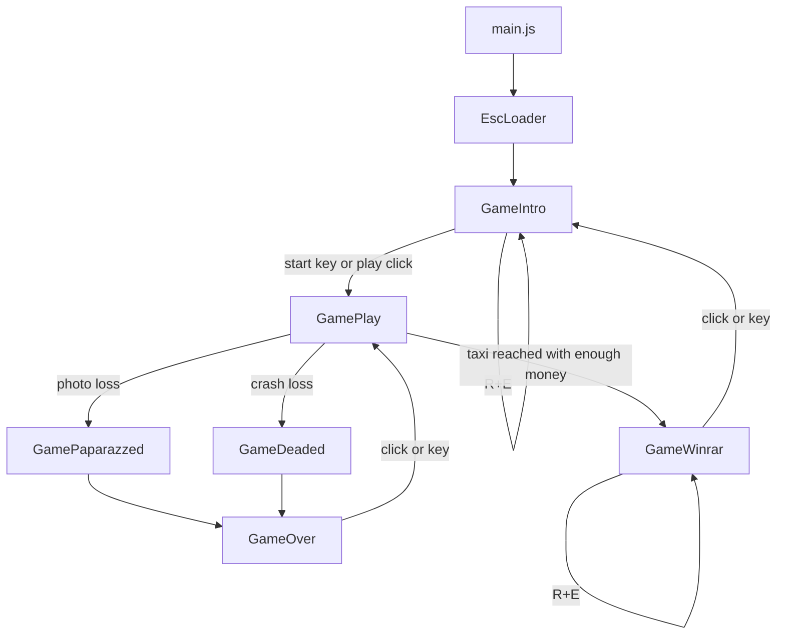

# Escaparazzi Porting Plan for Impact.js

## Goal

Port **Escaparazzi** from its current Flash/Flixel codebase to **Impact.js**, while preserving the gameplay rules and feel already documented in `implementation.md`.

This update turns the original framework-agnostic porting guide into an **Impact.js-specific implementation plan**.

The target is a faithful first port, not a redesign. The first playable Impact build should preserve:

- the `320x240` playfield
- the coarse `16x16` movement cadence
- wrap-around world edges
- no immediate reverse turns
- the follower chain with a 2-step delay behind the player
- the current car/taxi spawn rules and scoring values
- the single active coin invariant
- the delayed cash-in behavior after collecting a coin
- the shared damage cooldown between photos and crashes
- the fatal threshold at 9 total damage
- the rule that high score only saves on a successful win

## Why Impact.js is a good fit

Impact.js maps well to Escaparazzi's shape:

- `ig.main()` can boot the game at the original `320x240` resolution with a `2x` scale.
- `ig.Game` is already the runtime hub for update, draw, entity lists, background maps, and an optional collision map.
- `ig.Input` gives us action-based keyboard and mouse bindings that are cleaner than direct Flash key polling.
- `ig.Timer` and `ig.system.tick` give us game-time timers, which matches Escaparazzi's timer-heavy simulation.
- `ig.Loader` can replace the current preloader.
- `ig.Image`, `ig.AnimationSheet`, `ig.Font`, `ig.Sound`, and `ig.Music` replace embedded Flash assets with normal external files.

Impact is a good runtime target, but it should **not** dictate a continuous-physics rewrite. The current game is mostly a **discrete-step simulation** with a few real-time cooldowns. We should preserve that model inside the port.

## Non-goals

For the first Impact.js port, we should explicitly **not** do the following:

- port Flixel itself
- use Box2D
- rebuild the gameplay around Impact's default entity physics
- require Weltmeister for the core gameplay loop
- block milestone 1 on perfect shader/filter parity
- port `Gamejolt.as`

## Recommended overall approach

Use a **hybrid architecture**:

1. A **pure gameplay model** that owns rules, timers, scores, spawns, collisions, and win/loss transitions.
2. A thin **Impact runtime shell** for boot, input collection, rendering, audio, persistence, and screen transitions.
3. **Impact view entities** for visible objects and effects only. They mirror model state; they do not define gameplay.

That gives us the best of both worlds:

- the deterministic and testable core proposed in `implementation.md`
- an idiomatic Impact.js runtime for drawing, loading, audio, and input

In other words: **Impact hosts the game, but the rules live in the model.**

## Key architectural decision

### Do not make `ig.Entity` the source of truth

Escaparazzi's rules are full of engine-unfriendly quirks:

- wrap-around instead of wall collision
- a follower chain with invisible spacer behavior
- a shared cooldown for two damage sources
- taxi eligibility based on delayed money state
- explicit score events on collisions
- one active coin at a time
- deterministic drain behavior during the win sequence

Impact's built-in entity movement and collision support is useful, but it is optimized for **entity/world** and **entity/entity** interactions in a more conventional arcade/platformer style. If we move the rules directly into `ig.Entity.update()`, `check()`, and `collideWith()`, we will end up re-encoding the current game logic as engine-side side effects.

That is exactly the coupling we are trying to get rid of.

### Recommended rule

- **Gameplay state lives in the core model.**
- **Impact entities are render adapters.**
- **Gameplay-critical collision stays in the core model using explicit AABB checks.**

This is the single most important design choice in the port.

## Impact-specific target structure

A practical Impact.js layout for the port:

```text
index.html
lib/
  impact/
  game/
    main.js
    config.js
    session.js
    loaders/
      esc-loader.js
    services/
      save-store.js
      audio-router.js
      rng.js
    games/
      intro.js
      play.js
      paparazzed.js
      deaded.js
      game-over.js
      winrar.js
    core/
      game-config.js
      game-phase.js
      game-state.js
      input-snapshot.js
      tick.js
      collision.js
      movement.js
      spawning.js
      scoring.js
      transitions.js
    entities/
      player-view.js
      follower-view.js
      car-view.js
      taxi-view.js
      coin-view.js
      fx-explosion.js
      fx-money.js
      fx-score-popup.js
    ui/
      hud.js
      overlays.js
      button-hitareas.js
media/
  sprites/
  sounds/
  music/
  fonts/
```

Notes:

- `lib/game/main.js` should be the entry point because Impact module names map directly to file paths.
- The `core/` directory should avoid gameplay dependence on `ig.Game`, `ig.Entity`, `ig.Timer`, or `ig.Input`.
- `session.js` replaces the old global static `Data` access pattern for **inter-screen state**, while `save-store.js` owns **persistent storage**.
- `entities/` are visual projections of model objects, not rule owners.

## Bootstrap plan

### `main.js`

The original game boots at `320x240` with `2x` scale. In Impact we should preserve that literally:

```js
ig.module(
  'game.main'
)
.requires(
  'impact.game',
  'game.games.intro',
  'game.loaders.esc-loader'
)
.defines(function () {
  ig.System.drawMode = ig.System.DRAW.AUTHENTIC;
  ig.System.scaleMode = ig.System.SCALE.CRISP;

  ig.main('#canvas', GameIntro, 60, 320, 240, 2, EscLoader);
});
```

Important notes:

- Use **`DRAW.AUTHENTIC`** and **`SCALE.CRISP`** to preserve the pixel-art look.
- The `fps` parameter is still passed to `ig.main()`, but modern Impact runs through `requestAnimationFrame`; do not assume a fixed 60 fps simulation.
- The simulation should therefore use **timers and accumulators**, not frame-count-based movement.

### `EscLoader`

Use a custom loader only for the current preloader behavior:

- progress bar
- simple splash text/logo
- optional “loading” art

Do **not** move menu logic into the loader. The current `Intro` scene remains a normal game screen.

## Screen plan

The current game already has distinct scenes. In Impact, we should keep that structure rather than flatten everything into one mega-`ig.Game`.

Recommended game classes:

- `GameIntro`
- `GamePlay`
- `GamePaparazzed`
- `GameDeaded`
- `GameOver`
- `GameWinrar`

### Why separate `ig.Game` classes?

Because the existing Flash game already treats these as separate screens, and Impact gives us `ig.system.setGame()` for exactly this kind of transition.

This keeps the code easy to reason about:

- `GameIntro` owns title screen presentation and the hidden reset combo
- `GamePlay` owns the live gameplay loop
- `GamePaparazzed` and `GameDeaded` preserve distinct failure presentation
- `GameOver` handles restart-to-play behavior
- `GameWinrar` handles win presentation and return-to-intro behavior

### Passing state between screens

Impact's game switching is class-based, so we should not rely on constructor parameters for transitions.

Use a small shared session module instead:

```text
EscSession
  save:
    highScore
    achievements
  lastRun:
    score
    photos
    crashes
    money
    result
  resetPending
```

This replaces the old `Data` singleton pattern without turning persistence into global gameplay state.

## Runtime flow in Impact



## Mapping the current repository to Impact.js

| Current file / concern | Impact.js target | Notes |
|---|---|---|
| `src/Main.as` | `lib/game/main.js` | Boot with `ig.main()` at `320x240`, scale `2` |
| `src/Preloader.as` | `lib/game/loaders/esc-loader.js` | Custom Impact loader |
| `src/scenes/Game.as` | `lib/game/games/play.js` + `lib/game/core/*` | Split orchestration from gameplay rules |
| `src/scenes/Intro.as` | `lib/game/games/intro.js` | Title screen and click/key start |
| `src/scenes/GameOver.as` | `lib/game/games/game-over.js` | Restart directly into gameplay |
| `src/scenes/Paparazzed.as` | `lib/game/games/paparazzed.js` | Photo-loss transition screen |
| `src/scenes/Deaded.as` | `lib/game/games/deaded.js` | Crash-loss transition screen |
| `src/scenes/Winrar.as` | `lib/game/games/winrar.js` | Save high score, return to intro |
| `src/util/Data.as` | `lib/game/services/save-store.js` + `lib/game/session.js` | `localStorage` plus transient session state |
| `src/registry/AssetsRegistry.as` | `media/` assets + asset declarations in modules | Use `ig.Image`, `ig.AnimationSheet`, `ig.Sound`, `ig.Font`, `ig.Music` |
| `src/util/Gamejolt.as` | none in milestone 1 | Ignore initially |
| `src/org/flixel/**` | none | Replaced by Impact runtime |

## Recommended gameplay model inside Impact

The model proposed in `implementation.md` still applies, but the adapter target is now concrete.

### Suggested model shape

```text
GameState
  phase
  score
  money
  highScoreCandidate
  damage:
    photos
    crashes
    cooldownMs
  player:
    x
    y
    facing
    inputTimerMs
  chain:
    spacerCount = 2
    trailHistory[]
    followers[]
    nextSpawnMs
  traffic:
    forwardCars[]
    reverseCars[]
    taxi?
  pickups:
    activeCoin?
    pendingCashMs?
  timers:
    nextMoveMs
    winDrainMs
    fxCleanupMs
  transient:
    scorePopups[]
    flashes[]
    shakeMs
    events[]
```

### Core entry point

Keep one authoritative tick function:

```text
tick(state, input, dtMs, rng) -> TickResult
```

Where `TickResult` contains:

- `state`
- `events[]`
- `transitions[]`
- `audioCues[]`
- optional view-hint data such as popups or flashes

This core should remain independent of Impact APIs.

## Gameplay-specific Impact decisions

### 1. World and camera

Escaparazzi is a **single fixed-screen arena**, not a scrolling world.

Recommendations:

- Keep `ig.game.screen.x = 0` and `ig.game.screen.y = 0` during normal play.
- Only offset the screen during shake effects.
- Do not implement camera following.
- Treat the world edges as **wrap-around logic in the model**, not as map boundaries.

### 2. Collision map

For the first faithful port, there is no need for a tile collision map.

Recommendations:

- Use `ig.CollisionMap.staticNoCollision` (or leave the default no-collision map in place).
- Do not create wall tiles to simulate the playfield edges.
- Do not rely on Impact's tile trace for gameplay.

This game has no meaningful static wall geometry. The interesting interactions are all dynamic.

### 3. Do not use Box2D

Box2D is unnecessary and mismatched to this game.

Escaparazzi does not need:

- forces
- impulses
- rigid body simulation
- restitution-based collisions
- slope handling
- continuous world physics

The port needs explicit rectangles, timers, wraps, and score events. That is a much better fit for a custom deterministic model than a physics engine.

### 4. Use core AABB collision for all gameplay-critical interactions

Implement these checks in the core model:

- player vs paparazzi
- player vs forward cars
- player vs reverse cars
- cars vs followers
- player vs active coin
- player vs taxi
- forward cars vs reverse cars

This reproduces the current design from `implementation.md` without forcing the rules into Impact's entity collision lifecycle.

### 5. Keep spacer nodes as data, not entities

The current follower chain depends on two invisible spacer nodes.

In Impact:

- do **not** spawn invisible `ig.Entity` objects for spacer nodes
- do **not** re-create the old sentinel/index tricks
- represent the chain spacing through `trailHistory`, delayed segment samples, or a similar data-only structure

The same principle applies to lane sentinels. Use normal arrays.

## How to use `ig.Entity` in this port

### View entities only

Recommended visible entity classes:

- `EntityPlayerView`
- `EntityFollowerView`
- `EntityCarView`
- `EntityTaxiView`
- `EntityCoinView`
- `EntityFxExplosion`
- `EntityFxMoney`
- `EntityFxScorePopup`

Each view entity should hold a `modelId` and read from synchronized state. Its responsibilities are:

- current sprite/animation
- draw position
- visibility
- temporary effect animation
- draw order / `zIndex`

Its responsibilities should **not** include:

- scoring
- damage
- win/loss transitions
- spawning rules
- taxi eligibility
- coin lifetime
- follower-chain logic

### Stable IDs

Do not use Impact entity runtime IDs as gameplay IDs.

The core model should assign stable IDs to cars, followers, FX, taxi, and coin objects so that `GamePlay` can match model objects to existing view entities reliably.

### Collision flags

For most render entities in milestone 1:

- `collides: ig.Entity.COLLIDES.NEVER`
- `type: ig.Entity.TYPE.NONE`
- `checkAgainst: ig.Entity.TYPE.NONE`

That keeps Impact's entity system from becoming an accidental second gameplay engine.

## `GamePlay` responsibilities

`GamePlay` should be the only Impact game class that actively drives the live simulation.

It should own:

- the current `GameState`
- the input adapter
- the RNG adapter
- the mapping from model objects to view entities
- HUD rendering
- overlay rendering
- audio routing
- transition routing to other game classes

Pseudocode shape:

```text
update():
  input = readImpactInput()
  dtMs = ig.system.tick * 1000
  result = core.tick(state, input, dtMs, rng)
  state = result.state
  syncViewEntities(state)
  consumeEvents(result.events)
  handleTransitions(result.transitions)
```

This is the central adapter seam of the whole port.

## Input plan

Use action bindings instead of direct key codes.

Recommended bindings:

- `LEFT_ARROW`, `A` -> `left`
- `RIGHT_ARROW`, `D` -> `right`
- `UP_ARROW`, `W` -> `up`
- `DOWN_ARROW`, `S` -> `down`
- `SPACE`, `ENTER` -> `confirm`
- `MOUSE1` -> `click`
- `R` -> `resetR`
- `E` -> `resetE`

### Input rules

- Build an `InputSnapshot` each frame.
- Keep “no immediate reverse turn” in the **core model**, not the input adapter.
- Preserve the hidden `R + E` combo in `Intro` and `Winrar`.
- For menu hit areas, bind `MOUSE1` so `ig.input.mouse.x` and `ig.input.mouse.y` are updated.

### Optional mobile support later

If mobile support matters later, add touch bindings or HTML touch buttons after the keyboard/mouse port is complete.

## Timing plan

This is one of the most important parts of the Impact port.

### Rule

Use **Impact for frame timing**, but keep **gameplay timers in the model**.

### Recommended approach

- Convert `ig.system.tick` to milliseconds: `dtMs = ig.system.tick * 1000`.
- Keep all gameplay timers in milliseconds inside the model.
- Use accumulator/next-move timers for:
  - player movement
  - follower movement propagation
  - traffic motion
  - taxi motion
- Use ordinary timers for:
  - paparazzi spawn cadence
  - shared photo/crash cooldown
  - coin lifetime
  - delayed money increment (`cashGrab` equivalent)
  - win follower drain cadence
  - temporary flash / popup / effect cleanup

### Why not just use entity velocity?

Because the original game is not actually a free-moving velocity-based arcade game. It is a timed step system with a few continuous-looking overlays.

If we switch to velocity-based entity movement, we will very likely change:

- follower spacing feel
- car collision timing
- taxi reach timing
- edge-wrap timing
- input responsiveness around direction changes

### Use `ig.Timer` sparingly

`ig.Timer` is still useful for:

- menu-only blinking prompts
- screen transition delays
- loader animation
- UI presentation-only timing

But gameplay should remain in the model so tests stay deterministic.

## Assets and media plan

### Replace `AssetsRegistry` with normal media files

Move embedded Flash assets into `media/`:

- spritesheets
- standalone images
- bitmap font image(s)
- sound effects
- music track(s)

### Images and animation

Use:

- `ig.Image` for standalone art
- `ig.AnimationSheet` + `addAnim()` for actors and animated FX
- `ig.BackgroundMap` only if we want tile layers or repeated decorative maps

### Font strategy

Prefer one of these two paths:

1. **Faithful path:** convert the original font look into a bitmap font and render with `ig.Font`
2. **Low-risk path:** preserve the original HUD as sprite-based UI and use `ig.Font` only for secondary labels

For milestone 1, the safest choice is to keep the money-needed meter and other key HUD elements as art-driven sprites if that matches the original look.

### Sound and music

Use:

- `ig.Sound` for one-shot SFX
- `ig.music` for looped background music

Provide each sound in both `.ogg` and `.mp3` variants with the same basename.

### Audio router

Do not randomize sounds inside the gameplay model.

Instead, let the core emit cues like:

- `playSound('crash')`
- `playSound('camera')`
- `playSound('coin')`
- `playSound('pickup')`

Then `audio-router.js` can decide whether that means:

- one specific sound file
- one of several variants
- music ducking
- no-op when audio is disabled

## HUD and effects plan

### HUD

The HUD should be rendered from model state, not inferred from entities.

It should display:

- score
- high score
- money / remaining money needed
- photo count
- crash count
- state-specific messaging during intro, loss, and win screens

The current countdown-style money meter should be preserved if possible.

### Flash overlays

Replace Flash/Flixel visual effects with simple Impact draw-time overlays:

- white flash on photo damage
- red flash on car crash
- full-screen tint/overlay on transitions if needed

Implement these in `ui/overlays.js` or directly in `GamePlay.draw()`.

### Screen shake

Impact does not give us Flixel-style quake out of the box, but this is easy to replace.

Recommended first version:

- maintain a shake timer and intensity in transient state
- during draw, offset the screen by a small random amount
- reset to `0,0` when the shake timer expires

### Explosion and money FX

Use lightweight FX entities for:

- explosions
- poofs
- money popups
- score popups

These are purely visual. Spawn them from emitted core events.

### Scanlines / shader parity

Do not block the port on exact filter recreation.

Recommended order:

1. first playable without shader parity
2. add a simple static scanline overlay image if needed
3. only later attempt any custom canvas post-process effect if it still matters

## Persistence plan

### Replace `SharedObject` with `localStorage`

Implement a small storage service:

```text
SaveStore
  load() -> SaveData
  saveHighScore(score)
  reset()
```

### Save schema

Preserve the current behavior:

- persist `highScore`
- persist `achievements` placeholder if we want compatibility
- do not persist active run state
- do not save on failed runs
- only update/save high score on successful win

### Split session state from save state

This matters in Impact because game classes will switch during runtime.

- `save-store.js` owns persisted values
- `session.js` owns current run data and transition data

That is cleaner than reusing a single global mutable object for everything.

## Weltmeister recommendation

### Do not require Weltmeister for milestone 1

Escaparazzi does not currently benefit much from a level editor because:

- the playfield is one fixed screen
- there are no meaningful wall collisions
- almost every interesting object is dynamically spawned
- world layout is simple and can be created directly in `GamePlay.init()`

### Where Weltmeister could help later

Use it later only if we want:

- editable decorative road/background layers
- alternate arenas
- visual iteration on lane art
- non-gameplay map composition

Even then, lane logic and spawn logic should remain in config/model code.

## Concrete Impact module recommendations

### `config.js`

A single module for Impact-specific constants:

- canvas width = `320`
- canvas height = `240`
- scale = `2`
- draw mode = authentic
- scale mode = crisp
- z-index constants
- asset path constants

### `game-config.js`

A model config module for gameplay balance:

- movement interval
- initial paparazzi spawn timer
- repeated paparazzi spawn timer
- car movement step
- taxi movement step
- shared damage cooldown
- coin lifetime
- delayed money increment
- score values
- loss threshold
- taxi spawn threshold
- taxi win threshold

### `session.js`

Inter-screen transient state:

- `saveData`
- `lastRun`
- `lastResult`
- `resetPending`

### `save-store.js`

`localStorage` wrapper. No game rules here.

### `audio-router.js`

Maps core cues to `ig.Sound`/`ig.music`.

### `button-hitareas.js`

For intro/win/lose click regions if we keep buttons inside the canvas instead of moving them to DOM.

## Recommended extraction path from the current game

### Phase 1: Set up the Impact shell

Deliverables:

- `index.html`
- `lib/impact/` engine in place
- `lib/game/main.js`
- `EscLoader`
- `GameIntro` booting at `320x240` scale `2`
- crisp scaling and authentic draw mode configured

At this stage, placeholder art is fine.

### Phase 2: Port the gameplay core before visuals

Build the authoritative model first:

- `GameState`
- `GamePhase`
- `tick()`
- `InputSnapshot`
- deterministic RNG adapter
- all timers, spawns, collision checks, score changes, and win/loss logic

Do this before introducing fancy view code.

### Phase 3: Add `GamePlay` as an Impact adapter over the core

Responsibilities:

- collect input from `ig.input`
- call `tick()` with `dtMs`
- create and synchronize view entities
- route audio cues to Impact sound objects
- route transitions to the appropriate `ig.Game` class

The moment this works with placeholder rectangles and numbers, the port is already on the right path.

### Phase 4: Add presentation parity

Add the visual layer:

- sprite sheets
- HUD art
- score popups
- flash overlays
- shake
- explosion FX
- money FX
- intro/win/lose screens

### Phase 5: Add persistence and polish

- `localStorage` high score
- reset behavior
- optional donation/open-url handling
- sound variant tuning
- optional scanline overlay
- optional Weltmeister background pass

## Characterization tests to keep from the original guide

The tests listed in `implementation.md` still matter and should be written against the model, not the Impact shell:

- wrap-around in all four directions
- no immediate reverse turns
- two-step follower lag / spacer behavior
- crash score `+100`
- follower kill score `+250`
- money pickup score `+500`
- win cash-out score `+1000` per visible follower
- fatal threshold at 9 total damage
- taxi spawns at money `4`
- taxi can be taken only at money `5`
- only one active coin at a time
- high score updates only on successful win

### Additional Impact-specific integration checks

Add a few integration tests/checklists around the shell:

- intro starts on key and click
- `R + E` reset works in intro and win screen
- `GameOver` restarts directly into gameplay
- `Winrar` returns to intro
- mouse coordinates are active on screens that use click hit boxes
- audio cue routing does not crash when sound is disabled

## Preserve-vs-modernize decisions for the Impact port

These should be treated as explicit decisions, not accidental changes:

1. **Keep `320x240` at `2x` scale** for the first port.
2. **Keep the current discrete movement cadence** instead of switching to continuous velocities.
3. **Keep the taxi rule**: spawn at 4 money, usable at 5 money.
4. **Keep the shared photo/crash cooldown**.
5. **Keep the single active coin invariant**.
6. **Keep the opposite-traffic spawn bias** for the first faithful port.
7. **Keep win-only high score saving**.
8. **Keep `GameOver -> Play` and `Winrar -> Intro`** exactly as they are.
9. **Do not preserve the sentinel-entity implementation tricks**. Preserve behavior, not the hack.
10. **Do not preserve exact Flash shader implementation in milestone 1**. Preserve gameplay first.

## Things we should deliberately not port literally

These are implementation artifacts, not gameplay requirements:

- lane sentinels at index `0`
- spacer nodes as actual engine sprites
- global mutable save singleton access from everywhere
- Flixel overlap calls inside rule functions
- render-side sound decisions inside gameplay functions
- Flash `Sprite` buttons
- Flash `navigateToURL`
- vendored Flixel source tree

## Recommended first playable milestone

The best first Impact milestone is:

1. Boot to `GameIntro` through `ig.main()` and `EscLoader`
2. Enter `GamePlay`
3. Run the full gameplay loop through a pure model
4. Use placeholder visual entities synchronized from the model
5. Support scoring, damage, follower spawning, cars, taxi, coin pickup, and win/loss transitions
6. Save high score on win through `localStorage`

Once that works, the port is functionally successful even if:

- the exact art is temporary
- scanlines are missing
- menu buttons are simple hit boxes
- some sound variety is still placeholder

## Bottom line

Impact.js is a strong target for Escaparazzi, but the safest port is **not** a direct Flixel-to-Impact entity rewrite.

The right plan is:

- keep Escaparazzi's gameplay rules in a deterministic model
- let `GamePlay` adapt that model to Impact's runtime
- use separate `ig.Game` classes for intro/play/loss/win screens
- use Impact for assets, input, audio, drawing, and loading
- avoid Box2D, collision maps, and entity-physics-driven gameplay for the first faithful port

If we follow that structure, the port stays small, faithful, and testable. The core difficulty is not Impact.js itself; it is separating **rules** from **presentation** cleanly enough that Impact becomes a host instead of a rewrite trap.

## References

- Current game behavior and extraction notes: `implementation.md` in the Escaparazzi repository
- Impact.js documentation: Core / `ig.main()`, Game, Input, Timer, Entity, CollisionMap, Loader, Sound, Font, and Box2D overview
