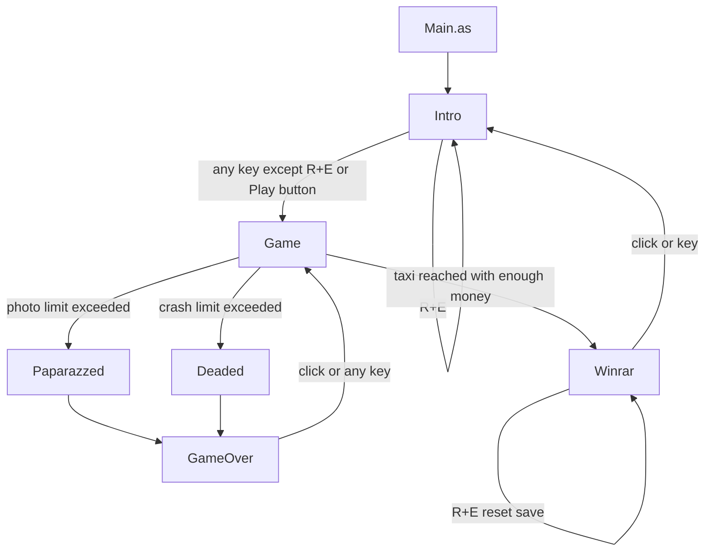

# Escaparazzi Standalone Porting Guide for Impact.js

## Goal

Port **Escaparazzi** from its current **AS3/Flixel** implementation to **Impact.js** while preserving the existing game’s player-visible behavior. This document is the single working guide for the port. It includes the current runtime flow, extracted gameplay rules, architectural decisions, file mapping, implementation order, and verification checklist needed to build a faithful first playable version.

The first port should prioritize **behavioral parity** over architecture experimentation. The goal is not to redesign the game. The goal is to reproduce the existing loop, rules, timings, and feel inside Impact.js with the smallest amount of framework-specific complexity.

## First-port scope

This port covers:

- bootstrapping the game in Impact.js
- loading and reusing the current assets
- implementing the full current screen flow
- preserving the gameplay rules and timings
- replacing the Flixel scene/state structure with Impact.js screens
- replacing Flixel sprites/groups with a gameplay model plus Impact view entities
- preserving the current scoring and persistence behavior

This first port does **not** require:

- Box2D
- an Impact collision map
- a scrolling camera
- a redesign of the game loop
- rebalancing thresholds, timings, or scores
- perfect Flash shader/filter parity
- porting Flixel itself
- porting `Gamejolt.as`
- requiring Weltmeister for the core gameplay loop

## First playable success criteria

The first playable Impact.js version should preserve:

- the `320x240` playfield at `2x` scale
- the coarse `16x16` movement cadence
- wrap-around world edges
- no immediate reverse turns
- the follower chain with a 2-step delay behind the player
- the current car/taxi spawn rules and score values
- the single active coin invariant
- the delayed cash-in behavior after collecting a coin
- the shared damage cooldown between photos and crashes
- the fatal threshold at 9 total damage
- the rule that high score only saves on a successful win

## Core porting decisions

### Impact.js is the host runtime, not the rules engine

Use Impact.js for:

- booting with `ig.main()`
- asset loading
- input bindings
- audio playback
- screen transitions
- rendering and animation
- persistence glue
- lightweight UI and effects

Do **not** let Impact dictate a continuous-physics rewrite. Escaparazzi is mostly a **discrete-step simulation** with a few real-time timers layered on top.

### `ig.Entity` is not the source of truth

Gameplay authority should stay in a framework-light gameplay model. Impact entities should be **view adapters** only.

That means:

- the gameplay model owns positions, scores, timers, spawns, collisions, and win/loss decisions
- Impact entities mirror model state for rendering and animation
- gameplay-critical collisions stay in the core model using explicit AABB checks
- scene transitions happen from a screen/controller layer, not from entity side effects

This is the single most important design choice in the port. A direct Flixel-to-Impact entity rewrite would scatter the rules across many entity classes and make parity harder.

### No Box2D, no collision map for milestone 1

For the first faithful port:

- do **not** use Box2D
- do **not** depend on an Impact collision map
- do **not** simulate the playfield edges with tiles or walls
- implement bounds, wrap-around, and overlap tests directly in gameplay code

The original game does not need physics. It needs rectangles, timers, wraps, and explicit rules.

## Current repository anatomy

| Path | Role today | Porting target |
| --- | --- | --- |
| `src/Main.as` | Boots Flixel at `320x240` with `2x` scale and starts `Intro` | `lib/game/main.js` |
| `src/Preloader.as` | Flash preloader wrapper | `lib/game/loaders/esc-loader.js` |
| `src/scenes/Game.as` | Main gameplay scene: simulation, input, collisions, score, FX, audio, scene changes | `lib/game/games/play.js` + `lib/game/core/*` |
| `src/scenes/Intro.as` | Title screen, play button, hidden reset combo, charity link | `lib/game/games/intro.js` |
| `src/scenes/GameOver.as` | Restart screen | `lib/game/games/game-over.js` |
| `src/scenes/Paparazzed.as` | Photo-loss transition screen | `lib/game/games/paparazzed.js` |
| `src/scenes/Deaded.as` | Crash-loss transition screen | `lib/game/games/deaded.js` |
| `src/scenes/Winrar.as` | Win screen and save trigger | `lib/game/games/winrar.js` |
| `src/util/Data.as` | Global score/high score data via `SharedObject` | `lib/game/services/save-store.js` + `lib/game/session.js` |
| `src/registry/AssetsRegistry.as` | Embedded art/audio/font/shader manifest | `media/` files + Impact asset declarations |
| `src/util/Gamejolt.as` | Legacy API wrapper | Ignore in milestone 1 |
| `src/org/flixel/**` | Vendored engine source | Do not port |

## Current runtime flow



### Screen behavior that must be preserved

- **Intro**
  - starts the game on any key except the `R + E` reset combo
  - also starts the game on play-button click
  - `R + E` clears saved data
  - includes a charity/donation button that opens an external URL; this is optional for milestone 1

- **Gameplay**
  - owns the simulation and transitions to loss or win paths

- **Paparazzed**
  - presentation-only photo-loss transition
  - auto-advances to `GameOver`

- **Deaded**
  - presentation-only crash-loss transition
  - auto-advances to `GameOver`

- **GameOver**
  - click or any key restarts directly into gameplay

- **Winrar**
  - displays current score and high score
  - saves persistent data
  - click or any key returns to Intro
  - `R + E` resets saved data

## Non-negotiable behavior to preserve

### World and arena

- The world is a **single-screen fixed arena**.
- Gameplay space is `320x240`.
- The display scale is `2x`.
- The player wraps around the screen edges instead of colliding with walls.
- The camera is effectively fixed; only shake offsets the screen.

### Discrete movement

- Movement is stepped, not analog.
- The player moves in `16x16` increments.
- Cars and taxis also move in coarse steps.
- Render updates may happen every frame, but gameplay movement must preserve the original cadence.

### Player input and facing

- The player starts with facing set to **UP**.
- The player **cannot immediately reverse direction**.
- Direction changes are allowed only when the requested direction is not the opposite of the current facing.
- The current code also uses an input timeout: movement stops only when no direction input has been held long enough for `inputTimer <= 0.1`. The timer resets to `15.0` while directional input is held. Preserve this behavior for the faithful port.

### Follower chain

- The chase chain includes:
  - player at index `0`
  - two invisible spacer nodes at indices `1` and `2`
  - visible paparazzi followers starting at index `3`
- The two spacer nodes are an implementation trick, but the **2-step lag behavior** is gameplay-critical.
- Followers trail deterministically and inherit prior positions with random jitter.
- Followers are not physics bodies. Do not rebuild this as spring motion or joints.

### Traffic, taxi, and pickups

- There are three moving lane systems:
  - forward traffic
  - reverse traffic
  - taxi lane
- A taxi begins spawning once money is high enough.
- The taxi only counts as a win if the money threshold is high enough.
- Only **one coin pickup can exist at a time**.
- Collecting a coin does **not** immediately increase the money counter; cash-in is delayed.

### Damage and failure

- Photos and crashes share a **single damage cooldown timer**.
- The game loses on the **9th total hit**, because the current check is `photos + crashes > 8`.
- The photo-loss path and crash-loss path are distinct screens and should stay distinct.

### Scoring and persistence

- Score events are deterministic and must keep their current values.
- High score is **only** updated on the win path.
- High score is **only** persisted on the win screen.
- Failed runs do not save.

## Extracted gameplay rules and current tuning values

This section is the most important parity contract in the document. Move these values into a central `GameConfig` module in the port instead of scattering them across runtime code.

### Arena and actor sizes

| Value | Current behavior |
| --- | --- |
| World size | `320x240` |
| Display scale | `2x` |
| Player sprite size | `16x16` |
| Follower sprite size | `16x16` |
| Car sprite size | `32x16` |
| Taxi sprite size | `32x16` |
| Movement step size | `16px` |

### Initial game state

At the start of a run:

| Value | Current setting |
| --- | --- |
| Score | `0` |
| Money | `0` |
| Photos | `0` |
| Crashes | `0` |
| `popStarSpeed` | `150 ms` |
| `nextMove` | `now + 300 ms` |
| `timerPaparazzi` | `4.0 s` |
| `moneyzTimer` | `11.0 s` |
| `cashGrab` | `9999` |
| `winnarTimer` | `0.2 s` |
| `explodeTimer` | `0.1 s` |
| `timerPhoto` | `0` |
| `inputTimer` | `15.0 s` |

Initial entity rosters:

- chase chain has 6 members:
  - player
  - 2 spacer nodes
  - 3 visible paparazzi followers
- forward traffic starts with:
  - 1 invisible sentinel
  - 1 real car
- reverse traffic starts with:
  - 1 invisible sentinel only
- taxi lane starts with:
  - 1 invisible sentinel only
- there is no money pickup yet

For the Impact port, remove the sentinel-sprite trick, but preserve the actual live counts and behavior.

### Player movement and wrap-around

- Facing starts at **UP**.
- Movement step is one `16px` move in the current facing.
- Wrap rules:
  - moving left from `x <= 0` wraps to `x = width - 16`
  - moving right from `x >= width - 16` wraps to `x = 0`
  - moving up from `y <= 0` wraps to `y = height - 16`
  - moving down from `y >= height - 16` wraps to `y = 0`
- If `inputTimer <= 0.1`, the player does not move even though facing is retained.

### Direction-change rules

- `UP` is blocked if facing is `DOWN`
- `DOWN` is blocked if facing is `UP`
- `LEFT` is blocked if facing is `RIGHT`
- `RIGHT` is blocked if facing is `LEFT`

Use abstract input actions in the port, but keep this rule in the gameplay model.

### Follower-chain behavior

When the player moves:

- save the player’s previous position
- each later chain segment copies the previous segment’s position
- add jitter of `[-4, 4]` on both axes
- the first trailing segment copies the player’s old position
- later segments copy the previous segment’s current position

Important current behaviors:

- the spacing behavior comes from two invisible spacer nodes plus the trailing update order
- the port should preserve the **result**, not the sentinel implementation
- a good model representation is:
  - `spacerCount = 2`
  - `trailHistory[]` or delayed segment samples
  - `followers[]` for visible paparazzi only

### Follower spawning

Follower spawning is timer-driven.

- initial spawn timer starts at `4.0 s`
- after the first trigger it repeats every `1.0 s`
- when the timer elapses:
  - `addFollower = true`
  - `timerPaparazzi = 1`
  - `popStarSpeed` may be reduced depending on money

Current player-speed pressure rules:

- if `money > 1` and `money <= 2` and `popStarSpeed > 140`, reduce speed by `1`
- if `money > 2` and `money <= 3` and `popStarSpeed > 110`, reduce speed by `2`
- if `money > 3` and `money <= 4` and `popStarSpeed > 100`, reduce speed by `3`
- if `money > 4` and `money <= 5` and `popStarSpeed > 90`, reduce speed by `4`

Current follower-spawn intensity uses a quirky switch on `rand(1, money)`:

- case `1`: spawn 1 follower
- case `2`: spawn 1 follower
- case `3`: spawn 2 followers
- case `4`: spawn 3 followers
- case `5`: spawn 4 followers
- case `6`: spawn 5 followers

Important quirk:

- values above `6` have no explicit case, so the current code stops increasing cleanly beyond that point
- preserve this exact behavior for the faithful port, then revisit only as a deliberate post-parity change

### Traffic behavior

Forward traffic:

- moves left-to-right by `+16px` per movement tick
- gets vertical wobble of `[-8, 8]`
- wraps from `x > 320` to `x = -32`
- on wrap, `y` resets to a random value in `[32, 224]`
- if `y > 240`, clamp/wrap to `16`
- if `y < 0`, clamp/wrap to `224`

Reverse traffic:

- moves right-to-left by `-16px` per movement tick
- gets vertical wobble of `[-8, 8]`
- wraps from `x < -32` to `x = 320`
- on wrap, `y` resets to a random value in `[32, 224]`
- if `y > 240`, clamp/wrap to `16`
- if `y < 0`, clamp/wrap to `224`

Opposite-flow overlap behavior:

- when forward and reverse cars overlap, they are pushed apart by `6px` on each axis
- neither car is destroyed in that case

Current spawn bias quirk:

- `spawnMoreCars()` chooses `rand(-1, 1)`
- forward traffic only spawns when the result is positive (`1`)
- reverse traffic spawns otherwise
- that means reverse traffic is favored **2/3 of the time**

Preserve this bias for the first port.

### Taxi behavior

- Taxi lane moves left-to-right by `+16px` per movement tick
- Taxi vertical wobble is `[-4, 4]`
- Taxi wraps from `x > 320` to `x = -32`
- if `y > 240`, clamp/wrap to `16`
- if `y < 0`, clamp/wrap to `224`

Spawn and use thresholds:

- a taxi begins spawning when `money > 3`, which means at **4 money**
- taxi only causes a win when overlapping the player and `money > 4`, which means at **5 money**

Current taxi-lane population rule:

- the old code keeps a sentinel at index `0` and spawns a taxi only when `taxiLane.members.length < 2`
- in the port, replace this with a clearer rule: at most one active taxi

### Damage and shared cooldown

The game uses a **single shared cooldown timer** for both photos and crashes.

Photo damage:

- when player overlaps a follower and `timerPhoto < 0`
  - increment `photos`
  - trigger camera flash feedback
  - set `timerPhoto = 0.4 * random + 0.1`
  - play camera sound

Crash damage:

- when player overlaps a car
  - score still increases
  - FX still happen
  - the car is removed and respawn logic still runs
- but crash count only increments when `timerPhoto < 0`
  - increment `crashes`
  - set red flash feedback
  - set `timerPhoto = 0.4 * random + 0.1`

This means repeated overlaps are intentionally rate-limited across both damage sources by one shared timer.

### Fatal threshold and failure paths

- The fatal threshold is the **9th total hit**
- Current checks:
  - photo loss when `photos + crashes > 8`
  - crash loss when `crashes + photos > 8`

Keep separate result states:

- `LostByPhotos`
- `LostByCrashes`

### Score values

Preserve these values exactly:

| Event | Score |
| --- | --- |
| Player hit by car | `+100` |
| Follower hit by traffic | `+250` |
| Collect money pickup | `+500` |
| Cash out visible follower during taxi win | `+1000` per follower |

Important ordering notes:

- car/player collision adds `+100` even if crash damage is still on cooldown
- follower/traffic collision adds `+250` and removes the follower and vehicle
- coin collection adds `+500` immediately, but money increments later after the cash delay

### Coin and money loop

- Followers do **not** directly give money.
- A follower killed by traffic may drop a coin pickup.
- A coin only drops if there is **no active coin already**.
- Coin collection gives score immediately but delays money increase.

Important current behaviors:

- only one active coin can exist at a time
- `collectMoney()` removes the coin and sets `cashGrab = 0.3`
- money increments later when `cashGrab` reaches `0`
- taxi eligibility uses the actual money counter, not collected-but-not-yet-cashed coin state

Current timer behavior:

- money pickups expire on a timer
- the timer starts from the current `moneyzTimer`
- when a coin times out, the current code resets `moneyzTimer = 10 - money`
- preserve the behavior first, even if a later cleanup pass normalizes the timer logic

### HUD rules

Money HUD:

- displays a countdown-style meter using:
  - `NEED_05` for money `0`
  - `NEED_04` for money `1`
  - `NEED_03` for money `2`
  - `NEED_02` for money `3`
  - `NEED_01` for money `4`
  - `NEED_00` for money `5`

Damage HUD:

- displays head states for total damage `0` through `8`

Important quirk:

- money can theoretically exceed the defined HUD range
- keep the current behavior for the faithful port, then clamp or extend deliberately later if desired

### Win flow

Taxi win is a state machine, not a one-shot transition.

Current behavior:

1. overlapping a taxi with enough money sets `winnar = true`
2. while in the win state, a timer counts down
3. if visible followers still exist, they are cashed out one at a time
4. each drained follower plays a money FX/sound and disappears
5. once only the player and two spacer nodes remain, the game transitions to `Winrar`

Score handling during win:

- the total follower-cashout bonus is added **once**
- the amount is `(popStarMob.members.length - 3) * 1000`
- subtracting `3` excludes:
  - player
  - spacer node 1
  - spacer node 2

High score handling during win:

- current score is compared to high score during the win drain
- the persistent save only happens when entering the win screen

For the port, represent the run phase as something like:

- `Running`
- `WinningDrainFollowers`
- `Won`
- `LostByPhotos`
- `LostByCrashes`

### Persistence

Current save data contains:

- `highScore`
- `achievements` array (currently unused)

Current save behavior:

- save data is loaded on boot
- the active run is **not** persisted
- failed runs are **not** saved
- the win screen calls `save()`
- `reset()` clears high score and achievements

Do not port the global static access pattern. Keep the save schema, replace the implementation.

## Recommended target architecture

Use a layered design.

### Layer 1: gameplay core

A framework-light gameplay model owns:

- game phase/state
- score and money
- player state
- follower-chain state
- vehicle state
- taxi state
- pickup state
- damage counters and cooldown
- timers
- win/loss flags

### Layer 2: Impact.js screens

Use separate `ig.Game` classes for:

- `GameIntro`
- `GamePlay`
- `GamePaparazzed`
- `GameDeaded`
- `GameOver`
- `GameWinrar`

These screens own:

- lifecycle
- input collection
- model creation
- syncing view entities
- transitions
- HUD and overlays

### Layer 3: Impact view entities

Recommended visible entity classes:

- `EntityPlayerView`
- `EntityFollowerView`
- `EntityCarView`
- `EntityTaxiView`
- `EntityCoinView`
- `EntityFxExplosion`
- `EntityFxMoney`
- `EntityFxScorePopup`

These entities should own:

- sprite sheet and animation selection
- draw position
- visibility
- z-order
- short-lived visual behavior

They should **not** own:

- scoring
- damage
- taxi eligibility
- coin rules
- follower-chain logic
- win/loss transitions

### Layer 4: services/adapters

Keep runtime-specific concerns behind small services:

- save/load via `localStorage`
- audio routing
- RNG
- UI hit areas
- asset references
- session handoff between screens

## Suggested Impact.js file structure

```text
index.html
lib/
  impact/
  game/
    main.js
    config.js
    session.js
    loaders/
      esc-loader.js
    services/
      save-store.js
      audio-router.js
      rng.js
    games/
      intro.js
      play.js
      paparazzed.js
      deaded.js
      game-over.js
      winrar.js
    core/
      game-config.js
      game-phase.js
      game-state.js
      input-snapshot.js
      tick.js
      collision.js
      movement.js
      spawning.js
      scoring.js
      transitions.js
    entities/
      player-view.js
      follower-view.js
      car-view.js
      taxi-view.js
      coin-view.js
      fx-explosion.js
      fx-money.js
      fx-score-popup.js
    ui/
      hud.js
      overlays.js
      button-hitareas.js
media/
  sprites/
  sounds/
  music/
  fonts/
```

## Impact.js boot plan

### `main.js`

Boot the game at the original resolution and scale:

```js
ig.module(
  'game.main'
)
.requires(
  'impact.game',
  'game.games.intro',
  'game.loaders.esc-loader'
)
.defines(function () {
  ig.System.drawMode = ig.System.DRAW.AUTHENTIC;
  ig.System.scaleMode = ig.System.SCALE.CRISP;

  ig.main('#canvas', GameIntro, 60, 320, 240, 2, EscLoader);
});
```

Use:

- `DRAW.AUTHENTIC`
- `SCALE.CRISP`

Do not assume a fixed-step `60 fps` simulation just because `ig.main()` receives `60`. Use `ig.system.tick` and model timers.

### Custom loader

Use a custom `EscLoader` only for:

- splash/loading art
- progress bar
- startup asset loading

Do **not** move menu logic into the loader.

## Session and persistence plan

Split transient state from persistent save data.

### Session state

Use a session module for inter-screen handoff:

```text
EscSession
  save:
    highScore
    achievements
  lastRun:
    score
    photos
    crashes
    money
    result
  resetPending
```

### Persistent save store

Implement a thin `localStorage` wrapper:

```text
SaveStore
  load() -> SaveData
  saveHighScore(score)
  reset()
```

Rules:

- load save data on boot or intro
- only write high score on the win path
- do not save during gameplay
- do not save after loss
- keep `achievements` as a compatibility placeholder if desired

## Suggested gameplay core

### Recommended model shape

```text
GameState
  phase
  score
  money
  saveHighScoreCandidate
  damage:
    photos
    crashes
    cooldownMs
  player:
    x
    y
    facing
    inputTimerMs
  chain:
    spacerCount = 2
    trailHistory[]
    followers[]
    pendingSpawn
  traffic:
    forwardCars[]
    reverseCars[]
    taxi?
  pickups:
    activeCoin?
    pendingCashMs?
    coinLifetimeMs?
  timers:
    nextMoveMs
    paparazziSpawnMs
    winDrainMs
    fxCleanupMs
  transient:
    scorePopups[]
    flashes[]
    shakeMs
    events[]
```

Use **pixel coordinates**, not tile coordinates, because:

- cars and taxi have vertical jitter
- collision is rectangle-based
- the original code already behaves in pixels even though movement is stepped

### Core update contract

Use one authoritative entry point:

```text
tick(state, input, dtMs, rng) -> TickResult
```

`TickResult` should contain:

- next `state`
- emitted gameplay `events[]`
- emitted `audioCues[]`
- emitted visual `effects[]`
- requested `transition`, if any

This makes the core deterministic and keeps Impact-specific behavior in the adapter layer.

## Screen responsibilities

### `GameIntro`

Owns:

- title screen art
- start input and click handling
- hidden `R + E` reset combo
- optional charity/donation button
- display of saved high score

### `GamePlay`

Owns:

- current `GameState`
- input adapter
- RNG adapter
- mapping from model objects to view entities
- HUD and overlays
- audio cue routing
- scene transitions

Representative shape:

```text
update():
  input = readImpactInput()
  dtMs = ig.system.tick * 1000
  result = core.tick(state, input, dtMs, rng)
  state = result.state
  syncViewEntities(state)
  consumeEvents(result.events)
  routeAudio(result.audioCues)
  handleTransition(result.transition)
```

### `GamePaparazzed`

Owns:

- photo-loss presentation
- timed transition to `GameOver`

### `GameDeaded`

Owns:

- crash-loss presentation
- timed transition to `GameOver`

### `GameOver`

Owns:

- failure screen
- click/key restart straight back into `GamePlay`

### `GameWinrar`

Owns:

- win summary
- current score display
- high score display
- actual save operation
- click/key return to `GameIntro`
- hidden `R + E` reset combo

## Input plan

Bind input actions instead of reading raw keys throughout the code.

Recommended bindings:

- `LEFT_ARROW`, `A` -> `left`
- `RIGHT_ARROW`, `D` -> `right`
- `UP_ARROW`, `W` -> `up`
- `DOWN_ARROW`, `S` -> `down`
- `SPACE`, `ENTER` -> `confirm`
- `MOUSE1` -> `click`
- `R` -> `resetR`
- `E` -> `resetE`

Build an `InputSnapshot` each frame. Keep these rules in the model:

- no immediate reverse turns
- gameplay movement controlled by timer/accumulator
- hidden `R + E` reset combo in intro and win screens

## Timing plan

This is critical.

### Rule

Use Impact for frame timing, but keep gameplay timers in the model.

### Recommended timer strategy

Convert `ig.system.tick` to milliseconds and keep all gameplay timers in milliseconds.

Use model timers for:

- movement cadence
- paparazzi spawn cadence
- shared damage cooldown
- coin lifetime
- delayed money increment
- win-drain cadence
- effect cleanup timers

Use `ig.Timer` only for presentation-only timing such as:

- blinking prompts
- simple loader animation
- non-gameplay menu effects

### Important timing detail from the original game

The original code mixes two timer styles:

- **movement cadence** in milliseconds via `getTimer()`
- **cooldowns and FX** in seconds via `FlxG.elapsed`

In the port, normalize these into one model-time unit, preferably milliseconds.

## Collision plan

Gameplay-critical collisions should be explicit AABB checks in the core model.

Implement checks for:

- player vs follower
- player vs forward car
- player vs reverse car
- player vs active coin
- player vs taxi
- followers vs forward traffic
- followers vs reverse traffic
- forward traffic vs reverse traffic

Do not rely on Impact entity collision flags for authoritative gameplay. For most view entities, use:

- `collides: ig.Entity.COLLIDES.NEVER`
- `type: ig.Entity.TYPE.NONE`
- `checkAgainst: ig.Entity.TYPE.NONE`

## Event and effect plan

The gameplay core should emit events rather than directly playing sounds or spawning renderer objects.

Example gameplay events:

```text
CrashOccurred
PhotoTaken
FollowerKilled
CoinSpawned
CoinCollected
TaxiReached
LostByCrash
LostByPhotos
Won
```

Example presentation effects:

```text
PlaySound("crash")
PlaySound("camera")
PlaySound("coin")
SpawnFx("explosion", x, y)
SpawnFx("money", x, y)
ScorePopup(250, x, y)
ScreenFlash("white", 100ms)
ScreenFlash("red", 100ms)
CameraShake(0.01, 100ms)
TransitionTo("deaded")
```

This preserves deterministic rules while letting Impact.js implement visuals however it wants.

## Assets and media plan

### Images

Move embedded Flash assets into `media/`:

- spritesheets
- standalone images
- HUD art
- overlays
- transition screens

Use:

- `ig.Image` for standalone art
- `ig.AnimationSheet` plus `addAnim()` for actors and animated FX

### Fonts and HUD text

Preferred approach:

- convert the original text look into a bitmap font and use `ig.Font`

Low-risk fallback:

- keep key HUD pieces as art-driven sprites
- use `ig.Font` or temporary canvas text for score/readouts until the bitmap font is ready

### Audio

Use:

- `ig.Sound` for one-shot effects
- `ig.music` for looping music

Provide both `.ogg` and `.mp3` versions where needed.

### Audio routing

Do not randomize sounds inside the gameplay model.

Current audio families:

- 5 coin sounds
- 5 crash sounds
- 5 camera sounds

Keep that choice in `audio-router.js`, driven by cues from the model.

## HUD, overlays, and FX plan

### HUD

Render the HUD from model state, not inferred entity state.

Display at minimum:

- current score
- high score where applicable
- money / money needed
- photo and crash damage state
- screen-specific prompts/messages

### Flash overlays

Replace Flixel overlays with Impact draw-time or lightweight entity overlays:

- white flash on photo damage
- red flash on crash damage
- optional screen tints for transitions

### Screen shake

Implement shake as a transient offset applied during draw:

- maintain shake timer and intensity in transient state
- offset `ig.game.screen` or draw positions during shake
- reset to zero when the shake ends

### Explosions, poofs, and score popups

Use lightweight FX entities or draw-time effects for:

- explosions
- camera poofs
- coin/money effects
- score popups

These are presentation-only.

### Scanlines and shader parity

Do not block the port on exact shader recreation.

Recommended order:

1. first playable without shader parity
2. simple static scanline overlay if needed
3. optional later post-process effect

## Preserve-vs-modernize decisions

These should be treated as explicit decisions, not accidental changes.

1. Keep `320x240` at `2x` scale.
2. Keep stepped movement rather than switching to analog velocity.
3. Keep the 2-spacer follower lag behavior.
4. Keep taxi spawn at 4 money and usability at 5 money.
5. Keep the shared photo/crash cooldown.
6. Keep the single active coin invariant.
7. Keep the reverse-traffic spawn bias.
8. Keep win-only high-score saving.
9. Keep `GameOver -> GamePlay` and `Winrar -> Intro`.
10. Do not preserve the sentinel-entity implementation trick; preserve the behavior.
11. Do not block milestone 1 on exact Flash shader parity.
12. Preserve the current follower-spawn quirk above money 6 until parity is verified.
13. Preserve the current money-HUD range quirk until parity is verified.

## Things not worth porting literally

These are implementation artifacts, not gameplay requirements:

- lane sentinels at index `0`
- spacer nodes as actual engine sprites
- global mutable save singleton access from everywhere
- Flixel overlap calls embedded directly in rule functions
- render-side sound choices inside gameplay functions
- Flash `Sprite` buttons
- Flash `navigateToURL`
- vendored Flixel source

## Concrete extraction map from current gameplay code

| Current function or concern | Problem today | Destination after split |
| --- | --- | --- |
| `Game.create()` | mixes simulation state and Flixel sprite creation | `newGameState()` + Impact scene setup |
| `Game.update()` | mixes timers, rules, HUD, FX, and transitions | `tick()` + adapter event handling |
| `handlePlayerInput()` | reads Flixel keys directly | Impact input adapter -> `InputSnapshot` |
| `moveMob()` | player/follower movement plus follower spawning | movement and spawn systems |
| `moveTraffic()` | traffic simulation plus taxi spawn | traffic/taxi systems |
| `moveOpositeTraffic()` | reverse-traffic simulation | traffic system |
| `crash()` | score, damage, FX, sound, car removal, respawn | collision resolver + emitted effects |
| `deadPaparazzo()` | score, follower removal, coin drop, FX, sound | collision resolver + emitted effects |
| `deadOpositePaparazzo()` | same | collision resolver + emitted effects |
| `deadpopStar()` | photo damage, flash, sound, loss transition | damage system + emitted effects |
| `collectMoney()` | score, delayed cash-in, sound | pickup system + emitted effects |
| `takeCab()` / `winComplicated()` | win-state logic mixed with presentation | phase machine + emitted effects |
| `updateHUD()` | loads graphics directly from state | HUD renderer |
| `coinSnd()` / `crashSnd()` / `cameraSnd()` | sound randomization in gameplay file | audio router |
| `Data` | global static save/session state | save store + session model |

## Recommended implementation order

### Phase 1: Audit and freeze behavior

- inventory all screens
- extract all gameplay constants
- inventory all image/audio assets
- list all score and threshold rules
- confirm save behavior and reset behavior
- write characterization tests for the current gameplay contract

### Phase 2: Boot the Impact app

- set up `index.html`
- add Impact runtime
- configure `ig.main()` at `320x240`, scale `2`
- add `EscLoader`
- boot to `GameIntro`

### Phase 3: Build the gameplay core first

Implement:

- `GameState`
- `GamePhase`
- `InputSnapshot`
- `GameConfig`
- `tick()`
- collision logic
- timers
- follower-chain logic
- traffic/taxi logic
- coin and money logic
- score logic
- win/loss logic

At the end of this phase, the core should be testable without real sprites.

### Phase 4: Build `GamePlay` as the Impact adapter

- read input from `ig.input`
- call `tick()` with `dtMs`
- create and sync view entities
- render HUD and overlays
- route sounds
- route transitions

### Phase 5: Add screen parity

- `GameIntro`
- `GamePaparazzed`
- `GameDeaded`
- `GameOver`
- `GameWinrar`
- hidden reset combo
- save/load integration

### Phase 6: Presentation polish

- final sprite sheets
- HUD art
- score popups
- shake and flash overlays
- explosions and money FX
- optional scanlines
- optional charity button

## Characterization tests and manual checks

Write tests against the gameplay core, not the Impact shell.

### Core gameplay tests

- wrap-around works in all four directions
- no immediate reverse turns
- player movement uses `16px` steps
- the initial movement delay and recurring move cadence match the original
- follower chain preserves a 2-step lag
- follower jitter is applied in the correct place
- crash score is `+100`
- follower-kill score is `+250`
- money-pickup score is `+500`
- win cash-out score is `+1000` per visible follower
- fatal threshold is the 9th total hit
- taxi starts spawning at money `4`
- taxi only wins at money `5`
- only one active coin can exist
- coin collection delays actual money increment
- high score only updates on successful win
- high score only persists on the win screen

### Integration checks for the Impact shell

- Intro appears first
- any key except `R + E` starts gameplay
- play click starts gameplay
- `R + E` resets save on Intro
- photo-loss transition reaches GameOver
- crash-loss transition reaches GameOver
- GameOver restarts directly into gameplay
- win screen returns to Intro
- `R + E` resets save on win screen
- mouse hit areas work on screens that need them
- disabled/missing audio does not crash the game

## Acceptance criteria

The port is complete when all of the following are true:

- the game boots in Impact.js through `ig.main()`
- it runs at `320x240` with intended `2x` scale
- assets load through a custom loader
- the screen flow matches the current game
- gameplay uses the original stepped movement cadence
- the follower chain matches the current behavior
- taxi and coin thresholds behave exactly as before
- the shared photo/crash cooldown matches the original logic
- the game works without Box2D and without a collision map
- the current asset set is usable in Impact.js
- audio is routed through Impact sound APIs
- the HUD is functional and readable
- high score saves only on the win path
- the game is playable end to end without depending on Flixel runtime code

## Common mistakes to avoid

- making `ig.Entity` the gameplay authority
- replacing deterministic follower movement with physics
- smoothing stepped movement into analog velocity
- saving high score from gameplay or loss code paths
- scattering threshold logic across unrelated files
- introducing a collision map before parity is achieved
- changing constants for convenience during the port
- tying game rules directly to Impact APIs
- “cleaning up” quirks before the first faithful version is verified

## Recommended first playable milestone

The safest milestone is:

1. boot to `GameIntro` through `ig.main()` and `EscLoader`
2. enter `GamePlay`
3. run the full gameplay loop through a pure model
4. use placeholder view entities synchronized from the model
5. support scoring, damage, follower spawning, cars, taxi, coin pickup, and win/loss transitions
6. save high score on win through `localStorage`

If that version works, the port is already functionally successful even if:

- final art is still placeholder
- shader parity is missing
- menu buttons are simple hit boxes
- some sound variety is still temporary

## Bottom line

Escaparazzi is highly portable because the real game is small and explicit:

- one chase chain
- two traffic flows plus one taxi lane
- one coin pickup type
- one shared damage cooldown
- a small set of score rules
- a small set of timed transitions

The difficult part is not the gameplay complexity. The difficult part is that the original gameplay scene stores simulation state inside Flixel sprites and groups while also triggering presentation side effects directly. The correct Impact.js port keeps the rules in a deterministic gameplay model and lets Impact host rendering, input, audio, loading, and screen transitions.

Build the faithful version first. Cleanups and modernizations can happen after parity is proven.
